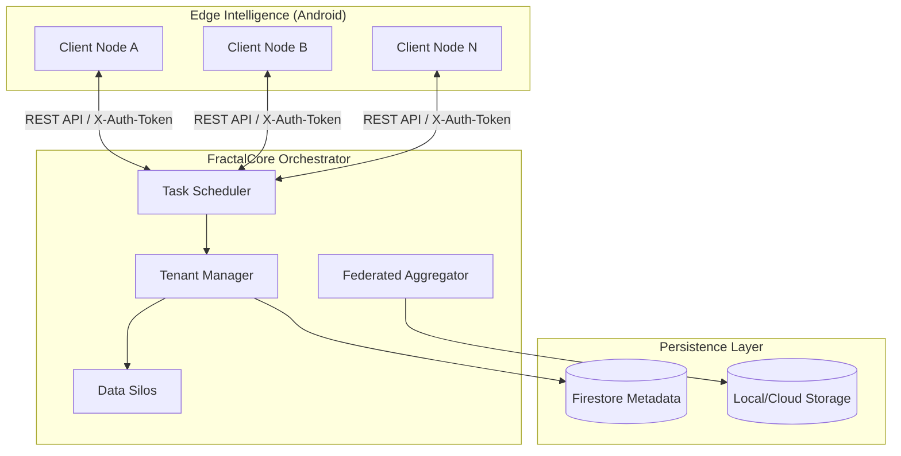
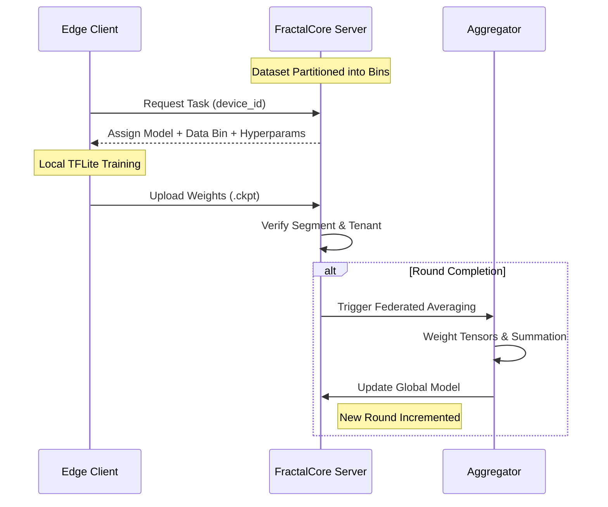
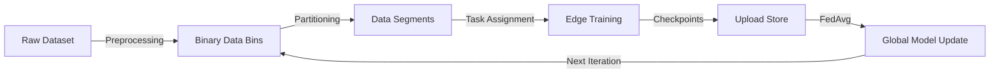
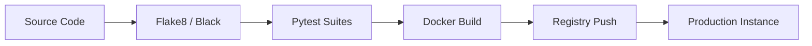

<div align="center">

# 🌌 FractalCore
### The Pulse of Federated Orchestration

[](https://semver.org)
[](LICENSE)
[](SECURITY.md)
[-red.svg?style=for-the-badge)](https://github.com/Fractal-Compute-Orchestrations)

**FractalCore** is a high-performance, multi-tenant orchestration engine designed for large-scale Federated Learning. It serves as the intelligent bridge between centralized model evolution and decentralized edge intelligence, ensuring privacy-first collaborative growth.

---
</div>

## 🧬 Philosophy

Computation is most powerful when it mirrors life: distributed, adaptive, and collective. FractalCore was built by **Ahmad Hassan (B-Ted)** to transform how mobile intelligence is cultivated. By moving the training to the data—rather than the data to the server—it respects the individual while empowering the collective.

---

## 🏗️ Architecture Overview

The system architecture is designed for extreme isolation and deterministic weight aggregation. It handles the complexity of thousands of asynchronous edge devices converging into a single global intelligence.



---

## 🔄 System Workflow

The lifecycle of a model round involves a carefully choreographed exchange between the orchestrator and its fleet of workers.



---

## 📊 Data Flow & Request Lifecycle

Understanding how information flows through the system is critical for scaling and security.

### Internal Data Pipeline


### Request Security & Routing
- **Authentication**: All tenant and admin interactions are governed by a strict `X-Auth-Token` lifecycle.
- **Isolation**: Multi-tenancy is enforced at the filesystem and database levels; data silos are physically separated.
- **Verification**: Client uploads are validated against task identifiers to prevent stale weight injection.

---

## 📁 Repository Structure

The codebase is structured to separate operational logic from experimental research.

| Directory | Purpose |
| :--- | :--- |
| `src/fractal_server` | **Core Orchestrator**: The production-grade multi-tenant engine. |
| `src/experimental` | **Research Lab**: Legacy versions and simplified single-user tests. |
| `docs/` | **Knowledge Base**: Deep technical specifications and API docs. |
| `scripts/` | **Ops Tooling**: Automated resetters, reward testers, and maintenance. |
| `tests/` | **Quality Control**: Integration and unit testing suites. |
| `.github/` | **Automation**: CI/CD workflows and contributor templates. |

---

## 🚀 Development & Deployment

### Build Pipeline


### Quick Start
To initialize the FractalCore environment:

```bash
# 1. Prepare Configuration
cp .env.example .env

# 2. Launch Orchestration via Docker
docker-compose up --build -d

# 3. Access Dashboard
# Navigate to http://localhost:5000
```

---

## 🤝 Contributions

New perspectives and technical improvements are welcomed. FractalCore is an evolving system, and contributions help refine the edge of distributed intelligence.

- **Found a bug?** Open a detailed [Issue](.github/ISSUE_TEMPLATE/bug_report.yml).
- **Want to improve the core?** Follow the [Contributing Guide](CONTRIBUTING.md).
- **Security concern?** Consult the [Security Policy](SECURITY.md).

---

## ⚖️ License

FractalCore is open-source software licensed under the [Apache License 2.0](LICENSE).

---

<div align="center">

**FractalCore** — Built with intention by **[Ahmad Hassan (B-Ted)](https://github.com/Fractal-Compute-Orchestrations)**.
*Orchestrating the future of collective intelligence.*

</div>
