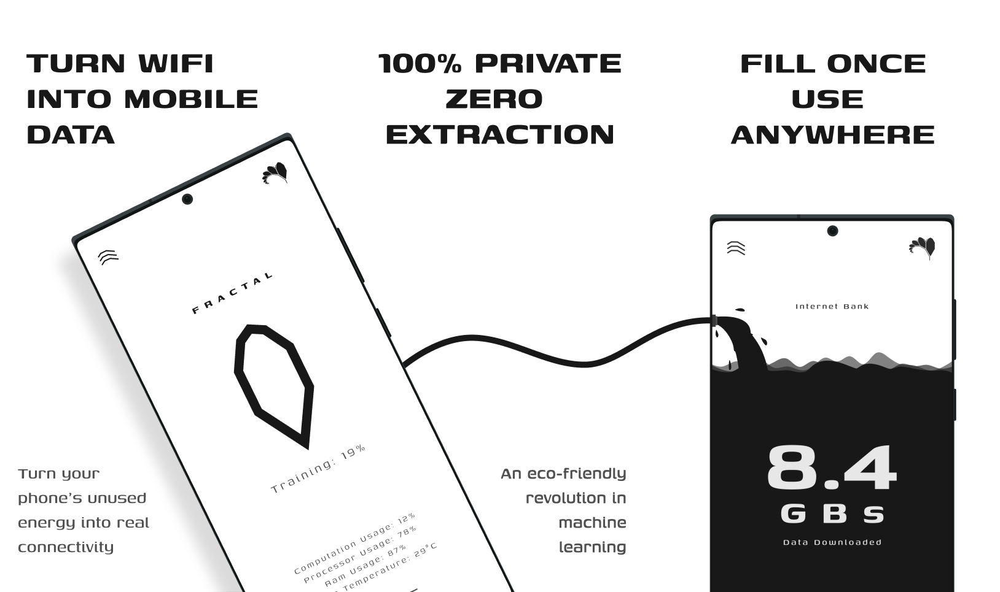
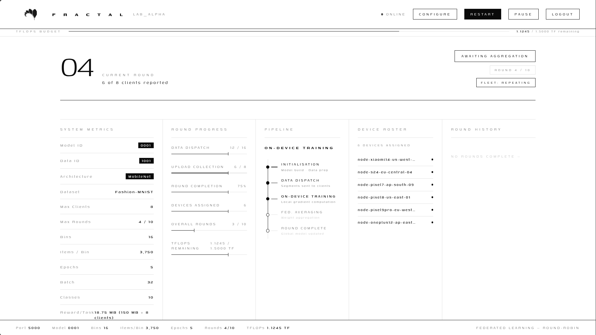
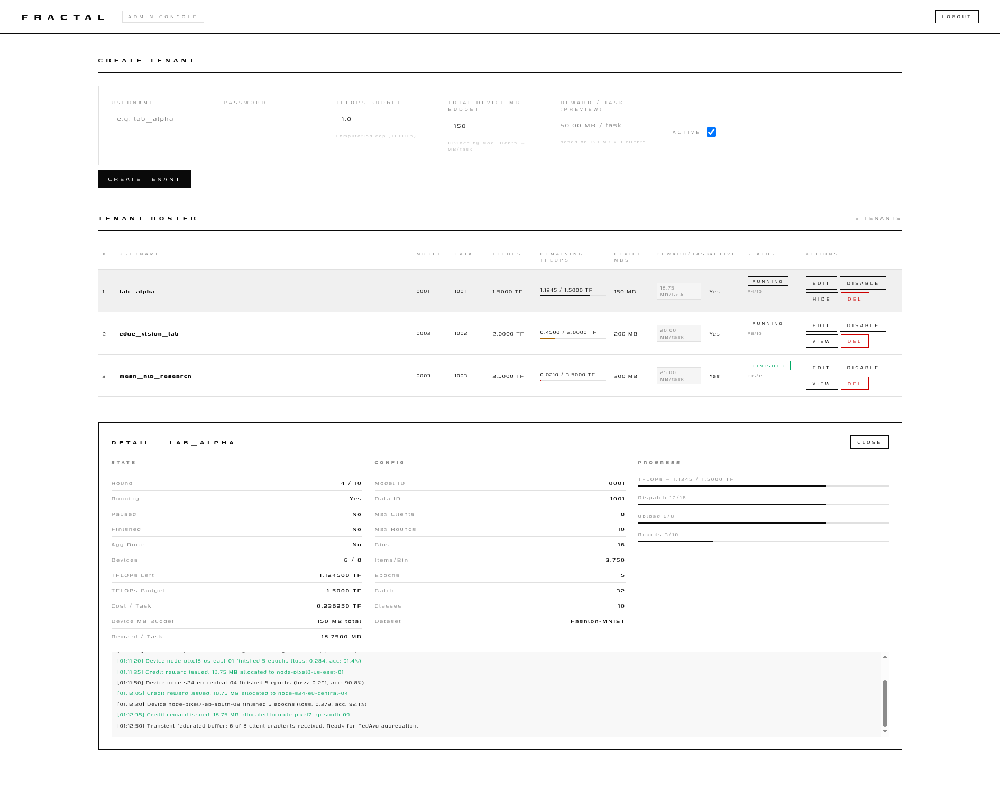
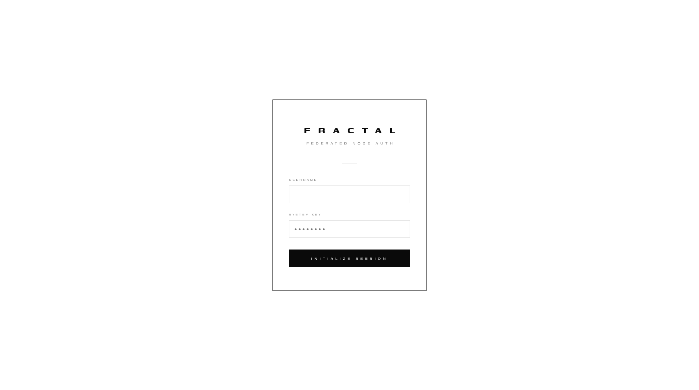
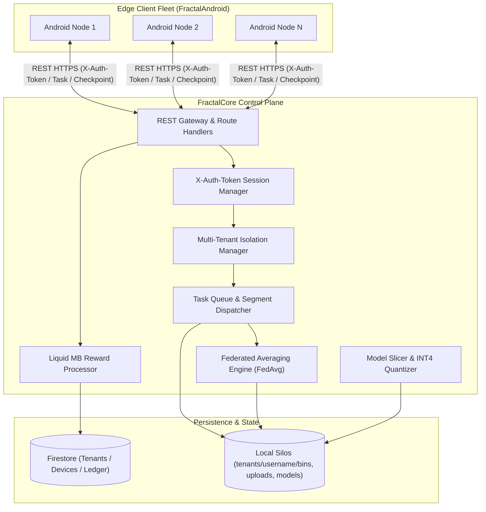
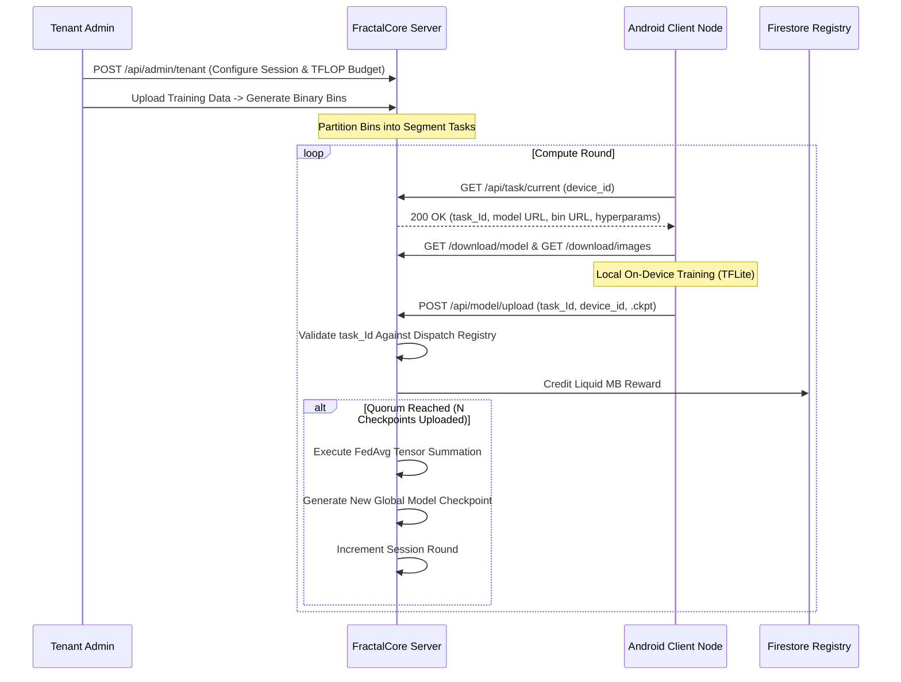

<div align="center">



# FractalCore
### High-Performance Orchestration Engine, Federated Aggregator, and Model Graph Slicer

[](https://semver.org)
[](LICENSE)
[](https://www.behance.net/gallery/221459335/Fractal)
[](SECURITY.md)
[-red.svg?style=flat-square)](https://github.com/Fractal-Compute-Orchestrations)

**FractalCore is the central server, control plane, and model compilation engine for the Fractal decentralized compute ecosystem.**

[Overview](#overview) | [Control Plane UI](#control-plane-web-interface) | [Design Case Study](https://www.behance.net/gallery/221459335/Fractal) | [Architecture](#system-architecture) | [Core Components](#core-components) | [Data Flow](#data-flow-and-lifecycle) | [API Summary](#api-reference-summary) | [Deployment](#deployment-and-execution) | [Security](#security-model)

---
</div>

## Overview

FractalCore serves as the centralized orchestration backbone that coordinates decentralized edge nodes (`FractalAndroid`). It handles the end-to-end lifecycle of distributed machine learning tasks, executing two primary operations:

1. **Federated Learning Orchestration**: Multi-tenant data binning, task scheduling, client checkpoint verification, and deterministic parameter aggregation via Federated Averaging (`FedAvg`).
2. **Foundation Model Slicing**: Offline neural graph surgery, INT4 weight quantization, static ATen graph tracing, and XNNPACK lowering (`inference-model-maker/slicer`) to produce memory-safe `.pte` layer partitions for mobile nodes.

---

## Control Plane Web Interface

FractalCore provides a hardware-accelerated, high-density Web UI engineered for orchestrating federated learning tasks, monitoring compute budgets, and isolating tenant silos:

<table>
  <tr>
    <th colspan="2" align="center">Tenant Operations Dashboard</th>
  </tr>
  <tr>
    <td colspan="2" align="center">
      
      <p align="center"><sub><b>Real-Time Tenant Dashboard:</b> Live TFLOPs quota gauge, dynamic round progress, active mobile node telemetry, and streaming activity log.</sub></p>
    </td>
  </tr>
  <tr>
    <th width="50%" align="center">Admin Fleet Console</th>
    <th width="50%" align="center">Node Authentication Portal</th>
  </tr>
  <tr>
    <td valign="top">
      
      <p align="center"><sub><b>Admin Console:</b> Tenant creation, TFLOPs computation caps, MB reward rates, and multi-tenant fleet roster.</sub></p>
    </td>
    <td valign="top">
      
      <p align="center"><sub><b>Authentication Gate:</b> Tab-isolated per-session tokenized access control with Genos typography.</sub></p>
    </td>
  </tr>
</table>

---

## System Architecture

FractalCore decouples tenant session control from compute dispatching and storage silos:



---

## Core Components

### 1. Multi-Tenant Orchestrator (`src/fractal_server/server.py`)
- **Tenant Sandboxing**: Maintains physically separated storage paths (`data/tenants/{username}/`) for datasets, training bins, uploaded checkpoints, and compiled global models.
- **Session Isolation**: Authentication relies strictly on the `X-Auth-Token` header (`secrets.token_hex(32)`), backed by a thread-safe token registry with zero cookie leakage between browser tabs or clients.
- **TFLOPs Budget Management**: Enforces per-tenant compute limits, monitoring compute capacity and round progression in real time.

### 2. Federated Aggregation Engine
- **Task Dispatching**: Distributes tasks (`ActiveTask`) referencing specific binary data bins to available Android nodes based on hardware telemetry proofs.
- **Deterministic Averaging**: Validates uploaded checkpoints against the active task registry and executes FedAvg weight summation using TensorFlow/NumPy upon reaching the round threshold.
- **Model Checkpointing**: Serializes and archives aggregated model weights, updating the active model served to subsequent rounds.

### 3. Model Slicing Compiler (`src/inference-model-maker/slicer/`)
- **Block Ingestion**: Ingests monolithic Hugging Face models (e.g., Llama 3 8B, TinyLlama) and extracts isolated decoder transformer blocks without breaking weight references.
- **INT4 Quantization**: Applies grouped weight-only quantization (`torchao` INT4, group size 128) targeting linear attention and MLP projections to reduce layer memory footprints below 150MB.
- **Static ATen Tracing**: Freezes dynamic Python operations into static computational graphs via `torch.export`.
- **XNNPACK Lowering & Export**: Lowering to ExecuTorch Edge dialect with XNNPACK microkernels, serialized into `.pte` binaries for zero-copy `mmap` ingestion on Android nodes.

### 4. Reward & Ledger Interface (`src/fractal_server/firebase_reward.py`)
- **Hardware Telemetry Verification**: Inspects device IDs and task receipts.
- **Liquid MB Settlement**: Credits compute tokens ("Liquid MBs") directly to user profiles in Google Cloud Firestore upon successful checkpoint verification.

---

## Data Flow and Lifecycle



---

## API Reference Summary

Full API schemas and contracts are documented in [docs/api.md](docs/api.md).

| Endpoint | Method | Authentication | Purpose |
| :--- | :--- | :--- | :--- |
| `/api/admin/login` | POST | None | Authenticate admin / tenant and receive `X-Auth-Token` |
| `/api/admin/tenants` | GET | `X-Auth-Token` (Admin) | List all registered tenants and compute budgets |
| `/api/admin/tenant` | POST | `X-Auth-Token` (Admin) | Provision a new tenant and allocate TFLOP budget |
| `/api/task/current` | GET | None / Device ID | Request active training task descriptor for a mobile node |
| `/api/model/upload` | POST | Multipart Form | Upload computed local checkpoint delta (`.ckpt`) |
| `/download/model` | GET | Query param | Download current global model checkpoint (`.tflite`) |
| `/download/images` | GET | Query param | Download binary dataset image segment bin |
| `/download/labels` | GET | Query param | Download binary dataset label segment bin |

---

## Directory Structure

```text
FractalCore/
|-- src/
|   |-- fractal_server/              # Production Multi-Tenant Server
|   |   |-- server.py                # Main Flask Application & API Routes
|   |   `-- firebase_reward.py       # Firestore Ledger & Credit Processor
|   |-- inference-model-maker/       # Model Slicing & Partitioning System
|   |   |-- run_pipeline.py          # Slicer CLI Orchestrator
|   |   `-- slicer/                  # Workstations, Validators & Contracts
|   `-- legacy/                      # Single-user prototypes & migration assets
|-- scripts/                         # Operations, Sweepers & Global Model Testers
|-- docs/                            # Deep Technical Specs, API & Architecture
|-- Dockerfile                       # Production Container Definition
|-- docker-compose.yml               # Multi-Service Orchestration Config
|-- requirements.txt                 # Core Python Dependencies
`-- tests/                           # Unit and Integration Test Suites
```

---

## Deployment and Execution

### Docker Deployment (Production Standard)

```bash
# 1. Configure Environment Variables
cp .env.example .env

# 2. Build and Launch Container
docker-compose up --build -d

# 3. Stream Container Logs
docker-compose logs -f
```

### Manual Host Execution

```bash
# 1. Create Virtual Environment
python3 -m venv venv
source venv/bin/activate

# 2. Install Dependencies
pip install -r requirements.txt

# 3. Launch with Gunicorn WSGI
gunicorn --bind 0.0.0.0:5000 src.fractal_server.server:app
```

### Code Formatting & Quality Verification

All Python source files must adhere to `black` formatting and `flake8` standards:

```bash
# Format Python source files
black .

# Check formatting compliance
black --check .

# Lint source files
flake8 . --count --select=E9,F63,F7,F82 --show-source --statistics
```

---

## Security Model

- **Zero Data Ingress**: The server never accesses raw user data; all computation occurs locally on edge devices.
- **Header-Bound Authentication**: Enforced `X-Auth-Token` validation without cookie fallback prevents cross-session bleeding.
- **Tenant Sandboxing**: Filesystem-level isolation prevents cross-tenant access to datasets, task queues, or checkpoint models.
- **Replay Protection**: Single-use `task_Id` assignment prevents duplicate or stale weight injection.

For full vulnerability reporting procedures, refer to [SECURITY.md](SECURITY.md).

---

## License

FractalCore is open-source software licensed under the [Apache License 2.0](LICENSE).

---

<div align="center">

**FractalCore** -- Architected and maintained by **[Ahmad Hassan (B-Ted)](https://github.com/Fractal-Compute-Orchestrations)**.

</div>
