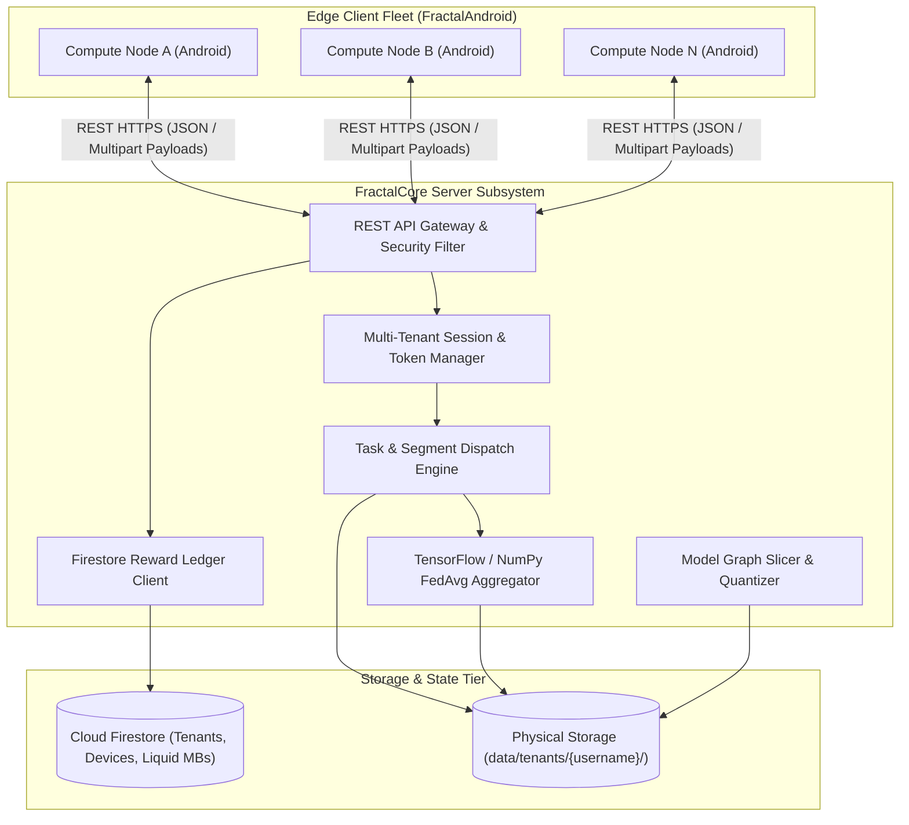
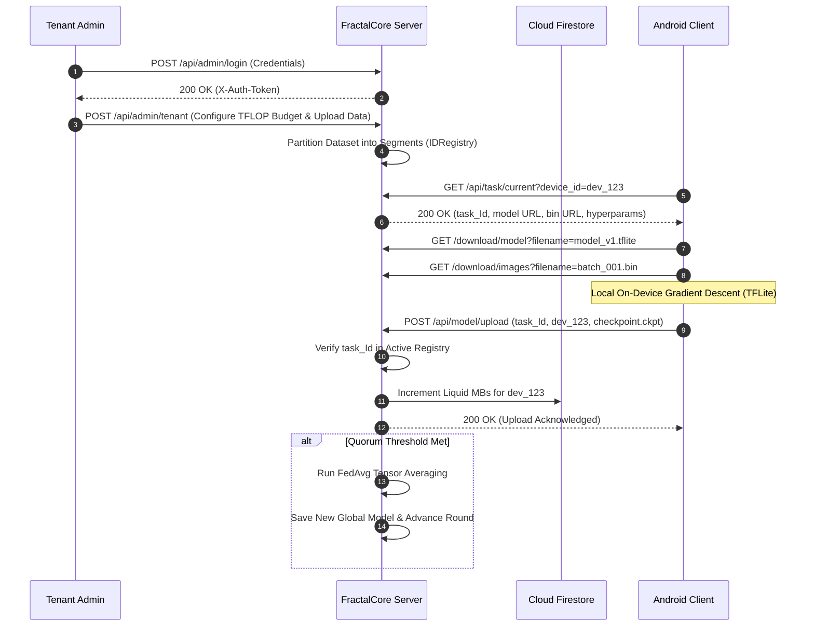

# FractalCore System Architecture Specification

## 1. System Overview

FractalCore is the centralized control plane of the Fractal distributed compute orchestration framework. It coordinates edge nodes (`FractalAndroid`) across two major workloads:
1. **Multi-Tenant Federated Learning**: Segmenting datasets into binary bins, managing task assignment, gathering `.ckpt` delta uploads, executing Federated Averaging (`FedAvg`), and settling rewards in Google Cloud Firestore.
2. **Foundation Model Slicing**: Compiling monolithic foundation models (Llama 3 8B, TinyLlama) into INT4-quantized, XNNPACK-delegated `.pte` layer partitions for zero-copy memory-mapped inference on mobile hardware.



---

## 2. Core Architectural Subsystems

### 2.1 Multi-Tenant Isolation Engine
The server provides strict tenant sandboxing:
- **Filesystem Segregation**: Each tenant operates in an isolated storage subtree:
  ```text
  data/tenants/{username}/
  |-- bins/              # Preprocessed binary dataset segments (images.bin, labels.bin)
  |-- uploads/           # Raw uploaded client checkpoint deltas (.ckpt)
  |-- global_model/      # Aggregated global model weights (.tflite / .ckpt)
  `-- session_state.json # Active round metadata, budgets, and participant tallies
  ```
- **Cryptographic Session Isolation**: Authentication relies on `X-Auth-Token` (32-byte cryptographically secure hex string). Tokens are held in an in-memory dictionary and validated per request without fallback to browser cookies, eliminating session cross-talk.

### 2.2 Task Dispatching and Segment Management
- **Binary Binning**: Raw datasets are preprocessed into binary chunks (`.bin`) with static stride sizes to allow rapid streaming over HTTP.
- **Round-Robin Task Scheduling**: The scheduler maps available data segments to compute nodes requesting tasks via `/api/task/current`.
- **Replay & Stale Injection Prevention**: Dispatched tasks generate an ephemeral `task_Id` stored in the `_global_task_tenant_map`. Once a checkpoint is uploaded against a `task_Id`, the record is consumed and invalidated.

### 2.3 Federated Averaging (FedAvg) Subsystem
When a tenant session reaches its required checkpoint threshold ($N$ client uploads):
1. **Weight Inspection**: The aggregator loads `.ckpt` numpy arrays from `data/tenants/{username}/uploads/`.
2. **Tensor Summation**: Computes the element-wise average across valid checkpoint matrices:
   $$\bar{W}_{t+1} = \frac{1}{K} \sum_{k=1}^K W_{t+1}^k$$
3. **Model Emission**: Exports the aggregated parameters as the new baseline global model.
4. **Tenant Rotation**: Increments the round counter, purges transient `.ckpt` files, and re-arms the task dispatch queue.

### 2.4 Foundation Model Slicing Compiler
For distributed pipeline-parallel inference, the `slicer/` module implements an offline compilation pipeline:
- **Stage 1 (Ingest)**: Maps FP16 weights to CPU memory using `torch.nn.Module` layer isolation.
- **Stage 2 (Quantize)**: Compresses linear attention matrices to INT4 via `torchao` (group size 128), restricting total layer footprint to $\le 150\text{MB}$.
- **Stage 3 (Trace)**: Produces static ATen dialect graphs using `torch.export.export()`.
- **Stage 4 (Lower)**: Emits ExecuTorch Edge dialect with XNNPACK microkernels for native ARM NEON acceleration.
- **Stage 5 (Export)**: Emits FlatBuffer `.pte` binaries for zero-copy `mmap` loading on Android devices.

---

## 3. Storage and Persistence Architecture

| Storage Domain | Underlying Technology | Access Pattern | Retention Policy |
| :--- | :--- | :--- | :--- |
| **Tenant Credentials** | `tenants.json` / Firestore | Read on login, write on provisioning | Persistent |
| **Token Registry** | In-Memory / `tokens.json` | Read on every authenticated request | Purged on logout or server restart |
| **Dataset Segments** | Local Filesystem (`.bin`) | High-throughput read stream | Retained for session duration |
| **Client Checkpoints** | Local Filesystem (`.ckpt`) | Write on upload, read on aggregation | Purged immediately following round completion |
| **Global Models** | Local Filesystem (`.tflite` / `.pte`) | Read on client download | Versioned and retained across rounds |
| **Reward Ledger** | Google Cloud Firestore | Atomic increment (`Increment(mbs)`) | Persistent historical record |

---

## 4. End-to-End Execution Sequence


