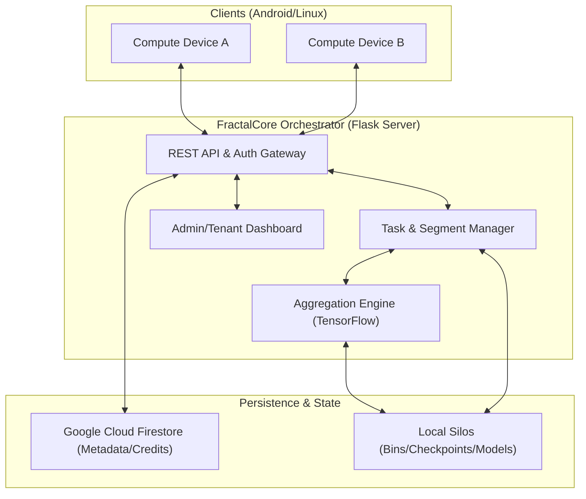

# FractalCore Architecture Overview

FractalCore is a high-performance orchestration engine for decentralized compute and Federated Learning. It manages model distribution, data segmentation, and weight aggregation across a network of client devices.

## High-Level System Architecture

---

## Core Components

### 1. Orchestration Layer (`server.py`)
The heart of the system, responsible for:
- **Tenant Management**: Secure multi-tenant isolation where each user has their own data silos.
- **Task Scheduling**: Distributing training tasks (`ActiveTask`) to devices using a Round-Robin strategy to maximize TFLOP utilization.
- **Authentication**: Token-based security (X-Auth-Token) ensuring session isolation between browser tabs and API clients.

### 2. Federated Learning Engine
Implements the decentralized training loop:
- **Data Segmentation**: The `IDRegistry` splits large datasets into secure, uniquely identified segments for parallel processing.
- **Federated Averaging (FedAvg)**: Once devices upload model updates (`.ckpt`), the engine aggregates weights to produce a global model.
- **TFLOPs Budgeting**: Tracks and limits computation per tenant to ensure fair resource allocation.

### 3. Persistence Strategy
FractalCore uses a hybrid approach:
- **Global Metadata (Firestore)**: Stores tenant credentials, device registrations, and liquid credits (MBS) for real-time synchronization.
- **Physical Data Silos**: Local filesystem storage handles heavy assets like `.bin` data bins and `.tflite` model files to minimize network latency during training.

### 4. Security Model
- **Firebase Service Accounts**: Securely manages cloud interactions.
- **SSH Keys**: Provides encrypted access for system maintenance.
- **Isolated Envs**: Private configurations (`tenants.json`, `.env`) are separated from the core logic to prevent leaks.

---

## Data Flow: Typical Training Round

1. **Initialization**: Tenant starts a session with a TFLOP budget.
2. **Task Creation**: Data is binned and tasks are queued in the `TenantSession`.
3. **Dispatch**: Device requests a task via `/api/task/request`.
4. **Compute**: Device downloads the `.tflite` model and data bins, performs training.
5. **Upload**: Device sends back a `.ckpt` weight update via `/api/task/upload`.
6. **Aggregation**: Once sufficient updates are received, the `FedAvg` engine computes the new global model.
7. **Credit**: Devices are rewarded with `liquid_mbs` in Firestore based on their contribution.
